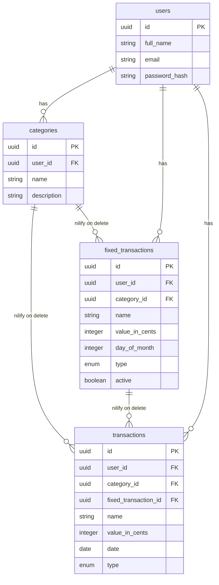

# Finhub

> **Work in progress** — this project is under active development. Features and APIs may change.

A personal finance web application built with Elixir and Phoenix LiveView. Track income and expenses, define recurring transactions, and get a clear picture of your monthly finances with projections and reports.

---

## Table of Contents

- [Overview](#overview)
- [Tech Stack](#tech-stack)
- [Architecture](#architecture)
  - [Umbrella Structure](#umbrella-structure)
  - [Command / Service Pattern](#command--service-pattern)
  - [Domain Organization](#domain-organization)
- [Database Schema](#database-schema)
  - [Design Decisions](#design-decisions)
- [Features](#features)
- [Background Jobs](#background-jobs)
- [Authentication](#authentication)
- [Getting Started](#getting-started)
  - [Prerequisites](#prerequisites)
  - [Local Development](#local-development)
  - [Docker](#docker)
- [Running Tests](#running-tests)

---

## Overview

Finhub is a full-stack personal finance tracker built as a portfolio project to demonstrate real-world Elixir patterns. It covers the full lifecycle of financial data: from defining recurring fixed costs, to tracking variable transactions, to visualizing monthly reports and future projections.

**Key capabilities:**

- Register and authenticate users securely
- Create and categorize income and expense transactions
- Define recurring (fixed) transactions that are automatically generated daily via a background job
- View monthly summaries broken down by type
- Project future months based on known fixed costs and registered variable transactions

---

## Tech Stack

| Layer | Technology |
|---|---|
| Language | Elixir ~> 1.15 |
| Web Framework | Phoenix 1.8 + LiveView 1.1 |
| Database | PostgreSQL 18 |
| HTTP Server | Bandit |
| Background Jobs | Oban 2.19 |
| Password Hashing | Argon2 (`argon2_elixir`) |
| HTTP Client | Req |
| Email | Swoosh (local dev mailbox) |
| Primary Keys | UUID v7 via `uniq` |
| CSS | Tailwind CSS v4 + daisyUI |
| Icons | Heroicons v2.2 |
| Asset Bundler | esbuild |
| Test Factories | ExMachina |
| Deployment | Docker (multi-stage build) |

---

## Architecture

### Umbrella Structure

The project is an **Elixir umbrella application** — a monorepo containing two independent, loosely coupled apps:

- **`apps/core`** — owns all business logic. It has no knowledge of HTTP or the web layer. It exposes services that take command structs and return tagged tuples.
- **`apps/finhub_web`** — owns the web layer. It calls `Core` services directly and must not contain business logic. LiveViews are thin — they delegate to `Core` immediately and only handle UI state.

This separation makes `core` independently testable and creates a clear boundary between domain and delivery mechanism.

---

### Command / Service Pattern

All mutations in `apps/core` follow a strict **Command → Service** pattern inspired by CQRS:

```
Command Struct  →  Service.execute/1  →  {:ok, result} | {:error, reason}
```

**Commands** are embedded schemas (no primary key) that define and validate the shape of incoming data. The `Core.EmbeddedSchema` macro adds `build/1` and `build!/1` helpers for safe construction.

**Services** are plain modules with a single `execute/1` function. One service = one responsibility.

Programmatic fields like `user_id` are **never cast** through `cast/2` — they are set explicitly before building the changeset, preventing mass assignment vulnerabilities.

`@spec` is required on all public functions in `apps/core` and enforced by Credo.

---

### Domain Organization

Each business domain lives in its own directory under `apps/core/lib/core/`, following the same structure:

```
<domain>/
  commands/   # Input structs with validation
  services/   # Business logic — one module per operation
```

Domains: `auth`, `user`, `category`, `transaction`, `fixed_transaction`, `dashboard`, `projection`.

---

## Database Schema



### Design Decisions

**Money as integers (cents)** — All monetary values are stored as integers in cents (`value_in_cents`). Floating-point arithmetic on money leads to rounding errors. Integer arithmetic is exact. Values are only formatted to a decimal string in the UI layer.

**UUID v7 primary keys** — UUIDs avoid exposing sequential IDs to clients. UUIDv7 is time-ordered, so database index performance is similar to auto-increment integers, without the sequential exposure.

**`nilify_all` on foreign key deletes** — When a `category` or `fixed_transaction` is deleted, associated `transactions` are not deleted — their foreign key is set to `NULL`. This preserves the financial record while removing the reference.

**`day_of_month` max 28** — To ensure the recurring schedule fires every month (February has 28 days at minimum), the maximum allowed day is 28.

---

## Features

### Dashboard

Displays a quick summary on login:
- Total value of active fixed expenses
- Projected total for the next month (fixed + variable already registered)

### Transactions

Full CRUD for individual income/expense events. The list view supports text search by transaction name or category name. Results are ordered by date (most recent first).

### Categories

User-scoped labels for organizing transactions. Name uniqueness is enforced per user at the database level.

### Fixed Transactions

Recurring transaction rules. Creating a fixed transaction atomically creates both the rule and the first associated `transaction` for the current month in a single database transaction.

Deactivating a fixed transaction stops the scheduler from generating future entries without deleting the rule or its historical transactions.

### Monthly Report

Aggregated view of transactions grouped by month, filterable by type. Totals are computed in the database via SQL aggregation.

### Projections

Forward-looking view per month. For months that already have transactions, those values are used directly. For future months, the projection is calculated from the sum of all active fixed transactions.

---

## Background Jobs

Oban is used for job scheduling and queuing. The Oban job table lives in PostgreSQL alongside application data.

### `ScheduleFixedTransactionsWorker`

- **Schedule**: Daily at 06:00 UTC (`0 6 * * *`)
- **Queue**: `default` (concurrency: 10)
- **Behavior**: Fetches all active `fixed_transactions` where `day_of_month` matches today. For each, inserts a `transaction` for the current month only if one doesn't already exist (idempotent by checking `fixed_transaction_id` + month window).

The idempotency guarantee means the job is safe to retry or run multiple times — duplicate transactions will never be created.

The Oban web dashboard is mounted at `/oban` for job monitoring in production.

---

## Authentication

Session-based authentication using Argon2 password hashing.

**Flow:**

1. User submits email + password to `POST /sign-in`
2. `AuthenticateUserService` fetches the user by email and verifies the password with Argon2
3. On success, `user_id` is written into the encrypted session
4. All authenticated routes go through `RequireAuthPlug` (controllers) and `FinhubWeb.Live.Hooks.UserAuth` (LiveViews)
5. On logout, the session is cleared and a PubSub message is broadcast to `users_socket:#{user_id}`, forcing all active LiveView connections for that user to disconnect immediately

**Test environment**: Argon2 cost is reduced (`t_cost: 1, m_cost: 8`) so tests run fast without sacrificing correctness.

---

## Getting Started

### Prerequisites

- Elixir >= 1.15 and Erlang/OTP (managed via `asdf` or `mise`)
- PostgreSQL running locally

### Local Development

```bash
# Install dependencies and set up the database
mix setup

# Start the dev server with live reload
mix phx.server
```

Visit `http://localhost:4000`.

**Available dev routes:**

| URL | Description |
|---|---|
| `http://localhost:4000` | Application |
| `http://localhost:4000/dev/dashboard` | Phoenix LiveDashboard |
| `http://localhost:4000/dev/mailbox` | Swoosh email preview |

### Docker

A `docker-compose.yml` is provided for running PostgreSQL locally without a system install:

```bash
docker compose up -d postgres
```

The multi-stage `Dockerfile` is for production builds:

```bash
docker build -t finhub .
```

1. **Builder** — Elixir/Erlang image compiles the app and assets, then produces a Mix release
2. **Runtime** — Minimal Debian image copies only the release artifact; no Elixir or build tools included

The final image runs as `nobody` (non-root).

---

## Running Tests

```bash
# Run the full test suite
mix test

# Run previously failed tests
mix test --failed

# Full pre-commit check: compile + format + test
mix precommit

# CI check: compile + format + credo + security audit + test
mix ci
```
